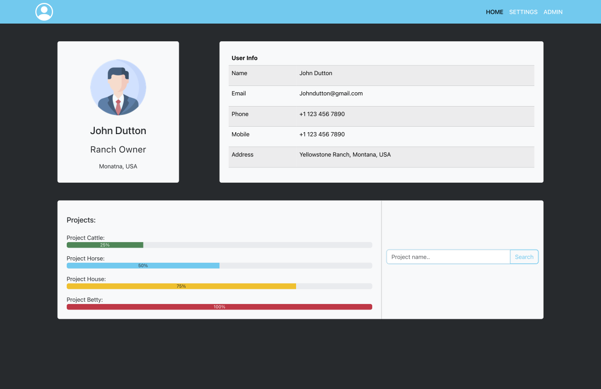
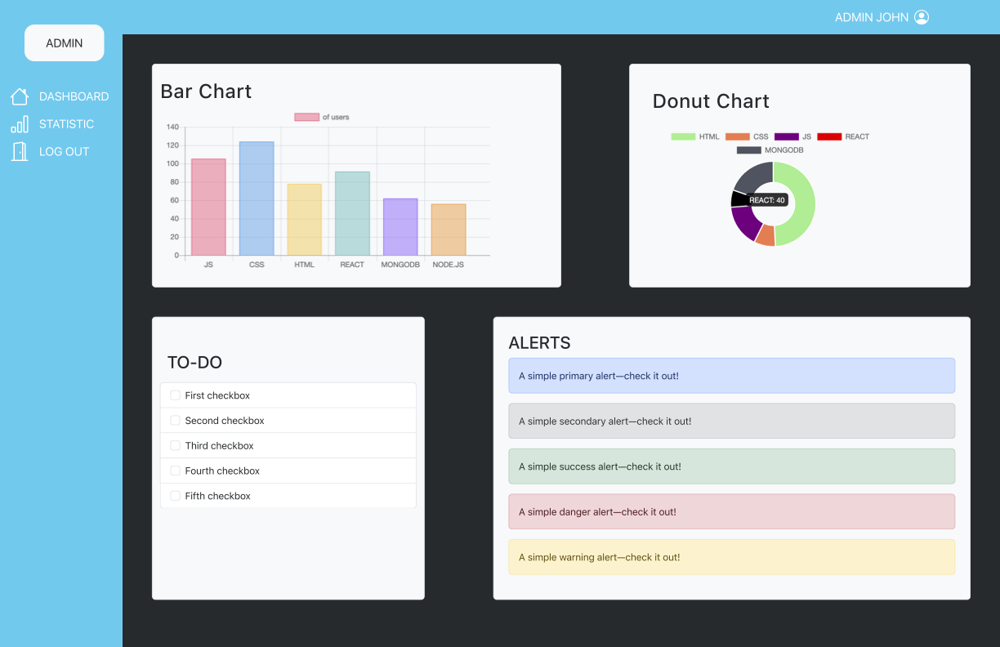

# bootstrap-user-admin-page

The task was to create user page and admin page using bootstrap.
Task from the PerScholas Bootcamp.
For charts I used chart.js Javascript library.

## Screenshots

User page:

Admin page:

